# University Bulletin Board
Communication of information has always been an issue in any university. Class representatives and faculties need to go from class to class to communicate important and volatile information. Information is circulated through mail, but there are many irrelevant mails in the inbox, which makes it difficult to segregate important and relevant information. 
CHARUSAT Bulletin Board aims to solve this issue. It is solely used to circulate important information. The information will be received by targeted students so that people don’t receive irrelevant information. Only authorized faculties and class representatives have the right to post an information update, which prevents misuse of the application.
Students can ask queries to the concerned authorities which can be answered by the faculty. So this is a common platform for sharing relevant information to the concerned students in a university.

# System Screenshots
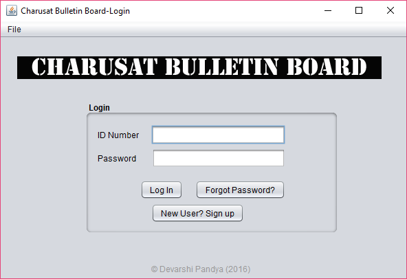
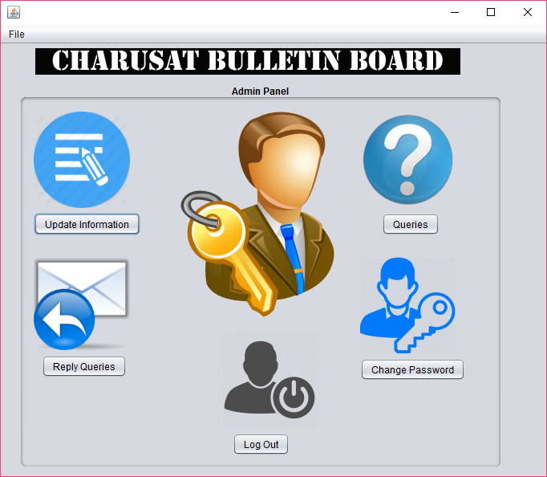
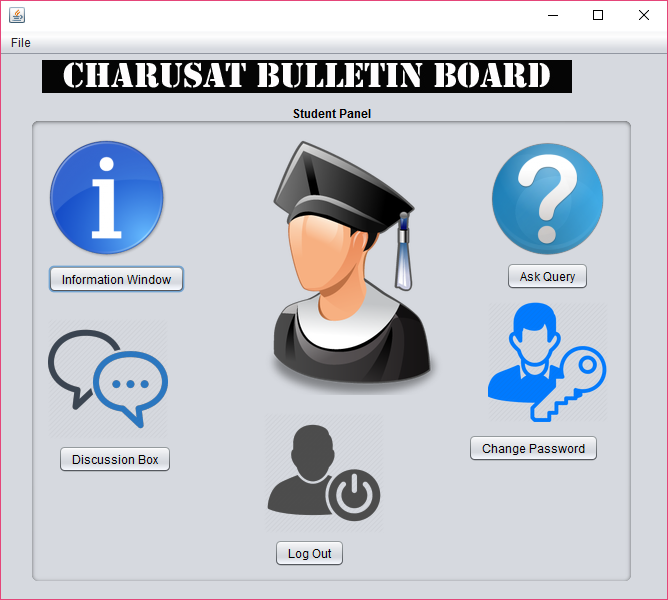
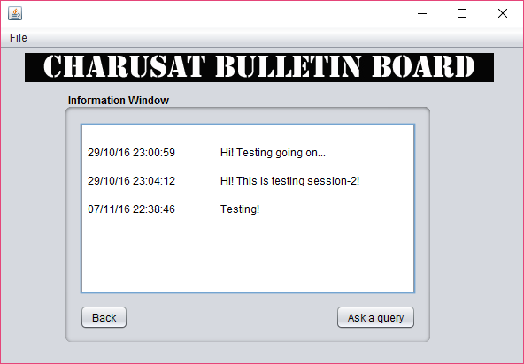
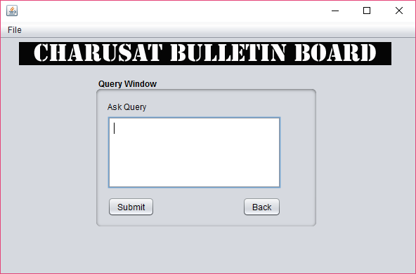
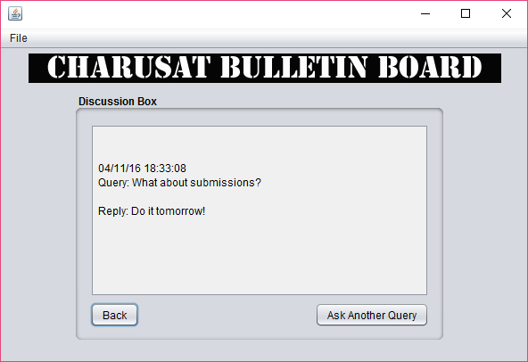
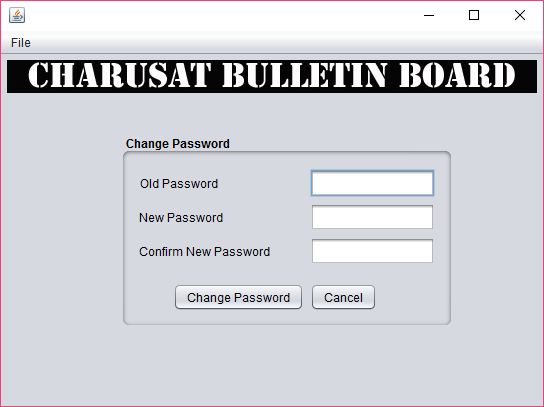
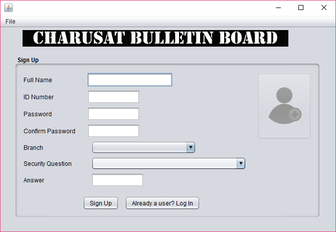
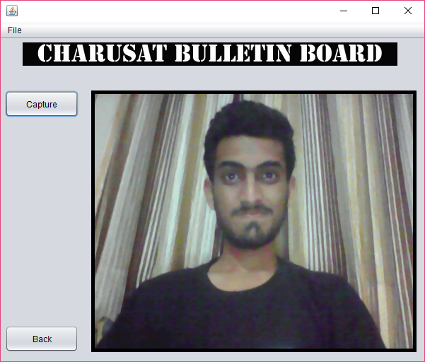
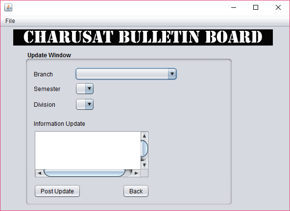
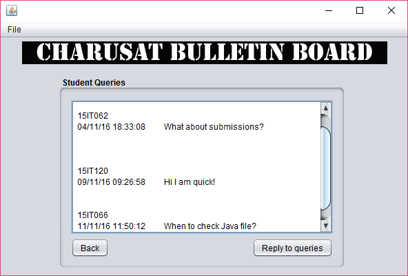
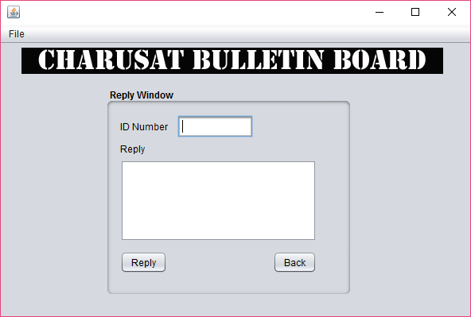
